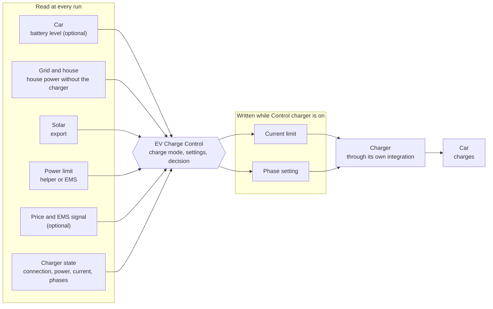

<p align="center"></p>

[](https://github.com/straybiker/HA-EV-Charge-Control/actions/workflows/test.yml)
[](https://github.com/straybiker/HA-EV-Charge-Control/actions/workflows/validate.yml)
[](https://hacs.xyz)

A Home Assistant integration for smart EV charging. It sets the charge current and the number of phases from your house power, solar surplus, power limit, electricity price, EMS signal and the car's battery level. It also counts the energy that goes into the car.

> [!IMPORTANT]
> **A new device starts in shadow mode.** It calculates what it would set and shows it on its sensors, but writes nothing until you switch **Control charger** on. See [Taking control of the charger](#taking-control-of-the-charger).


*The optional [dashboard](#the-dashboard), generated from your setup.*

## Contents

- [How it works](#how-it-works)
- [Features](#features)
- [Requirements](#requirements)
- [Installation](#installation)
- [Configuration](#configuration)
- [User manual](#user-manual)
- [Troubleshooting](#troubleshooting)
- [Roadmap](#roadmap)
- [Documentation](#documentation)
- [Contributing](#contributing)
- [License](#license)

## How it works

The controller sits between your house and the charger. It does not talk to the car or the charger itself: it reads the entities of their own integrations and writes the charger's current limit and phase setting.



1. **Read.** Every few seconds (10 s by default) the controller reads the house power, the solar export, the power limit and the charger's state. Optional inputs: the car's battery level, an electricity price and an EMS signal.
2. **Decide.** The charge mode and the settings on the device turn these into a target current and number of phases, within the power limit.
3. **Write.** With **Control charger** on, the controller writes the target to the charger's current limit and phase setting, and checks that the charger follows. With it off (shadow mode), it only shows the target.
4. **Charge.** The charger sets the car's charging power. The new charger power and battery level are read again at the next run.

## Features

- **Seven charge modes:** Off, 1-Phase Minimum, 3-Phases Minimum, Limited, Fast, Solar and Comfort.
- **Capacity tariff:** one power limit for the whole house, from a helper or your EMS, with an optional safety buffer.
- **Solar first:** charges on surplus. A small grid bridge closes the gap when the surplus is just below the minimum.
- **EMS and price:** an EMS signal (watt budget or on/off) and a maximum electricity price control the grid share.
- **Car aware:** emergency, target and comfort battery levels.
- **1 and 3 phases:** switches phases, with a hold time that prevents flapping.
- **Energy:** charged energy, split into grid and solar, for the Energy dashboard or an EMS.
- **Dashboard:** an optional dashboard in the sidebar, built from your setup, with a shadow comparison view when the YAML package is installed.
- **Safe by design:** a sensor fault never increases the current. Writes are confirmed, retried and reported as a repair issue when the charger does not follow. Settings survive restarts.
- **Any charger** whose Home Assistant integration has a current-limit number and a phase setting: a select, a switch or a number.

## Requirements

- Home Assistant 2026.3 or later.
- Your charger's own integration, with these entities:

  | Entity | Example |
  |---|---|
  | Charger power (W) | The charger's active power. |
  | Applied current limit (A) | The limit that the charger applies now. |
  | Active phases | A sensor that shows 1 or 3. |
  | Connection state | A Mode 3 sensor (A, B1 … D2, E, F), or a binary sensor that is on while a car is connected. |
  | Maximum current (A) | The charger's configured or installation maximum. |
  | Current limit | A `number` entity that the charger accepts. |
  | Phase setting | The entity that switches between 1 and 3 phases: a `select` (an option per phase count), a `switch` (on/off) or a `number` (a value per phase count). For a charger that only charges on 1 phase, the 3-phase option or value can stay empty. |

- **House power without the charger** (W or kW; negative during export). Power inputs need a unit of measurement. If you only have a grid meter, make a template sensor: grid power − charger power. A sensor smoothed over approximately 15 s gives the best results.
- **A power limit entity** (W or kW): a helper or an entity of your EMS. See [power limit](#power-limit-and-the-capacity-tariff).
- Optional: the car's battery level, an electricity price, an EMS signal, the charger's energy meter.
- For the optional [dashboard](#the-dashboard): nothing extra. It uses only built-in cards and works on every supported Home Assistant version. From Home Assistant 2026.6, the lines of its power graph get their own colours. It needs the Dashboards integration, which Home Assistant loads by default.

## Installation

**HACS**

[](https://my.home-assistant.io/redirect/hacs_repository/?owner=straybiker&repository=HA-EV-Charge-Control&category=integration)

1. Select the button above, or in HACS open the menu, select **Custom repositories** and add `https://github.com/straybiker/HA-EV-Charge-Control` with the type **Integration**.
2. Install **EV Charge Control** and restart Home Assistant. To get pre-releases (versions such as `0.3.0-beta.1`), turn on **Show beta versions** for the repository in HACS.

**Manual**

1. Copy `custom_components/ev_charge_control` into the `custom_components` folder of your Home Assistant configuration.
2. Restart Home Assistant.

Then go to **Settings → Devices & services → Add integration → EV Charge Control**. Each setup creates one charge-controller device for one charger.

## Configuration

**Inputs and outputs.** Every few seconds the controller reads its **inputs**, decides how fast the car may charge, and sets its **outputs**.

- **Inputs** are entities the controller only reads: what the charger reports, the house power, and optionally the battery level, the electricity price and an EMS signal.
- **Outputs** are the two entities of your charger's own integration that the controller changes: the charging current limit and the phase setting. It writes to them only while **Control charger** is on.

The setup steps are numbered and named after what they ask for: outputs, inputs or fixed values. To change the setup later, select **Configure** on the integration page; it shows the same steps, without the name.

| Step | Kind | What you enter |
|---|---|---|
| New charge controller | | The device name, **Add a dashboard** (on) and the **Dashboard name**. On the first controller of a system with the EV Load Balancer YAML package: **Import from EV Load Balancer** (see the [migration guide](docs/migration.md)). |
| Charger outputs | Writes | The charging current limit (`number`) and the phase setting (`select`, `switch` or `number`) of your charger. |
| Phase options | | How the phase setting says 1 and 3 phases: the options of a select, what On means for a switch, or the values of a number. Leave the 3-phase option or value empty for a charger that only charges on 1 phase. |
| Charger inputs | Reads | Connection state, charging power, applied current limit, active phases, maximum current. Optional: energy meter. |
| Charger limits and safety | Fixed | Minimum current (6 A), voltage per phase (230 V), current step (0.1 A or 1 A), widen small decreases (on for Alfen), fallback current (7 A) and phases (1), keep the phases on a sensor fault (off), what the charger gets when Control charger is switched off (fallback). |
| House | Reads | House power without the charger, power limit (sensor or number). Optional: peak factor as a safety buffer (empty: 100 %), solar power. |
| Car (optional) | Reads | Battery level, battery capacity, car maximum and minimum current. Without a battery level, the battery targets have no effect. |
| Price and EMS (optional) | Reads | Price sensor (or one of its attributes), EMS signal. Without a price, the price check is skipped. |
| Tuning | Fixed | Power update threshold (230 W), phase switch delay (5 min), recalculation interval (10 s). |
| Dashboard (Configure only) | | **Show the dashboard**, the **Dashboard name**, and **Rebuild the dashboard**. See [The dashboard](#the-dashboard). |

**More than one controller.** Each controller needs its own charger outputs; setup refuses a current limit or phase setting that another controller uses. When a new controller reads the same charger sensors, battery level, house power, power limit or EMS signal as another one, setup shows a warning with the shared entities before it saves. Two controllers on one house power sensor both take the full headroom and together exceed the power limit. Solar power and the price can be shared.

The controller uses the **fallback current and phases** after a sensor fault, and one minute after the car is unplugged. This makes the next session start gently. With **Keep the phase on a sensor fault** off, a fault switches to the fallback phases. A charger that stops responding then does not stay on an unintended phase.

## User manual

### The device

The setup creates one device, **EV charger controller**, with these entities:

| Kind | Entity | Function |
|---|---|---|
| Setting | Control charger | Write to the charger. Off on a new device. See [Taking control of the charger](#taking-control-of-the-charger). |
| Setting | Charge mode | See [charge modes](#charge-modes). |
| Setting | Max charging cost (per kWh) | Above this price, the car does not use the grid, except in Fast mode. Default 0.30. |
| Setting | Target SOC, Comfort SOC, Emergency SOC (%) | Battery levels. They need **Car aware**. Defaults 80, 50 and 20 %. |
| Setting | Solar bridge (W) | The grid power that Solar mode can import to reach the minimum. Default 0 W: solar only. |
| Setting | Car aware | Use the car's battery level. |
| Setting | Charge on solar when EMS blocks | When the EMS signal is 0 W, grid modes charge on solar instead of stopping. |
| Setting | Single phase only | Never use 3 phases. Always on, and cannot be switched off, when the setup has no option for 3 phases. |
| Setting | EMS control, EMS as on/off | The EMS signal limits the grid, as a watt budget or as on/off. |
| Decision | Target current, Target phases, Target power | What the controller sets now, or would set with Control charger off. |
| Decision | Effective power limit | The limit in use: the power limit entity × the peak factor. See [power limit](#power-limit-and-the-capacity-tariff). |
| Decision | Available for the car, Available from grid, Available from solar | The power the car would get now in the current charge mode, as if it were charging, and its grid and solar parts (W). Mode, price, EMS, power limit and charger limits all count: in Solar mode it is only the export. While the car charges, it equals the target power. Known also without a car. |
| Decision | EMS active | On while the EMS signal is above 0 W. Unknown when the setup has no EMS entity. |
| Decision | Decision | The reason. See [decision values](#decision-values). |
| Decision | Car connected | Whether a car is plugged in, as the controller reads it from the connection entity. Unknown while that entity is unavailable. |
| Decision | Grid allowed | Whether price and EMS allow the grid now. Known also without a car. |
| Decision | Emergency charging, Target reached | Yes/no details of the decision. |
| Energy | Charged energy, Charged from grid, Charged from solar (kWh) | Totals for the Energy dashboard or an EMS. |
| Energy | Average charging power (W) | The mean charger power while charging above 1000 W, over the last 60 days: energy ÷ charging time. The speed your car usually charges at, for planning by an EMS. Unknown until the car has charged. |
| Energy | Charged today, Charged from grid today, Charged from solar today (kWh) | The same since local midnight; they start again at 0 every day, so no utility meter helper is needed. |
| Diagnostic | Solar surplus | The house export now (W), also without a car. |
| Diagnostic | Car from grid, Car from solar | The target power split into the part from the grid and the part from the solar surplus (W). Together they are the target power; 0 W while the controller does not charge. |
| Diagnostic | Charger efficiency | Measured charger power ÷ commanded power, learned while charging. Starts again at 100 % after a restart. |
| Diagnostic | Phase hold until | When a running phase hold ends. Empty (unknown) while no hold runs. |

Settings keep their value after a restart. The controller runs at the recalculation interval. It also runs immediately when the mode, a setting, the connection or the phase changes.

### The dashboard

With **Add a dashboard** on, the controller gets a dashboard in the sidebar. **Dashboard name** sets its name; the default is **EV Charge Control**. With the default name and more than one controller, the other dashboards add the device name, for example **EV Charge Control Garage**. It uses only built-in cards:

- **Overview:** live status and what the car draws, the power budget for the current mode, gates and inputs, power today, a timeline of today's decisions, phases, car connection, Mode 3 state and gates, the settings, the energy charged today and since setup, and the average charging power.
- **Shadow comparison:** only when the EV Load Balancer YAML package is installed. It sets the controller's setpoint next to what the package writes to the charger, for the shadow-mode period.

Edit it like any other dashboard; the edits stay. To add or remove it later, select **Configure** on the integration page and go to the last step, **Dashboard**:

- **Show the dashboard** on adds it; off removes it and your edits.
- **Dashboard name** renames it. The content stays.
- **Rebuild the dashboard** builds it again from the current setup and discards your edits. Use it after you change entities in the setup, or after an update.

The dashboard belongs to the controller. It is listed under **Settings → Dashboards**, but the integration sets its name and icon at every start, and it is removed with the controller. To add, remove, rename or rebuild it, use **Configure**, not the dashboard settings.

### Taking control of the charger

A new device starts with **Control charger** off: it calculates, but writes nothing. How you switch it on depends on what sets the charger today.

**Clean install** (nothing sets the charger's current or phases):

1. Plug in the car, select a charge mode and check the device: **Decision**, **Target current** and **Target phases** must match what you expect for that mode.
2. Make sure nothing else writes to the charger, for example a schedule or load balancing in the charger's own app.
3. Switch **Control charger** on.

**Migrating** (an automation or the EV Load Balancer YAML package sets the charger now):

1. Leave **Control charger** off for some days. Compare **Target current** and **Target phases** with what your automation sets. With the YAML package, the **Shadow comparison** view of the [dashboard](#the-dashboard) shows both side by side.
2. Turn off the automation or the package. Two controllers on one charger work against each other.
3. Switch **Control charger** on.

For the YAML package, the [migration guide](docs/migration.md) has the full steps: import, parameter mapping, comparison and removal of the package.

**When Control charger is on**, the controller writes to the charger's current-limit number and phase setting. It switches from 1 to 3 phases at 0 A, and it checks that the charger follows each write: the applied current within 30 s, the active phases within 60 s. A write that the charger does not follow is written again at the next run. After 3 in a row, the decision shows **Charger not responding** and a repair issue appears under **Settings → Repairs**. Both clear when the charger follows again.

**When you switch Control charger off**, the charger gets the fallback current and phases once, so it does not stay at a high current that nothing controls. The setup option in Charger limits and safety can change this to *Leave as it is* or *Stop charging (0 A)*.

### Charge modes

| Mode | Behaviour |
|---|---|
| **Off** | No charging. |
| **1-Phase Minimum** | Exactly the minimum current on 1 phase (6 A ≈ 1.4 kW), from grid or solar. |
| **3-Phases Minimum** | Exactly the minimum current on 3 phases (6 A ≈ 4.1 kW). Stops when there is not sufficient power; does not change to 1 phase. Not possible together with Single phase only. |
| **Limited** | Grid up to the power limit, with solar added. |
| **Fast** | As much as the charger accepts, within the power limit. **Skips the price check:** it also uses the grid when the price is above Max charging cost. EMS still applies. |
| **Solar** | Solar surplus only. When the surplus is just below the minimum, the solar bridge imports the difference. |
| **Comfort** | Limited until the car reaches the comfort SOC, then Solar. Needs Car aware; without it, Comfort operates as Limited. |

**What each mode follows.** No mode skips the power limit: the car only gets the power that the house leaves available. Two cases skip the price check or the EMS:

| Mode | Power limit | Max charging cost | EMS |
|---|---|---|---|
| 1-Phase and 3-Phases Minimum | Follows | Follows | Follows |
| Limited | Follows | Follows | Follows |
| **Fast** | Follows | **Skipped** | Follows |
| Solar | Follows | Bridge only | Bridge only |
| Comfort | Follows | As Limited, then as Solar | As Limited, then as Solar |
| **Emergency charging** (any mode except Off, battery below Emergency SOC, needs Car aware) | Follows | **Skipped** | **Skipped** |

"Bridge only": the price and the EMS can block the solar bridge, but Solar mode keeps charging on the export.

### Power limit and the capacity tariff

The **power limit** is the most power the house may take from the grid, charger included. The car gets the remainder: limit − house power.

The limit comes from an entity that you pick in the House step: a helper you set by hand, or an entity of your EMS. The controller only reads it.

With a capacity tariff, you pay for the highest quarter-hour peak of the month, so charging up to that peak costs nothing extra. Let your EMS keep the limit entity at the higher of two values: a minimum limit that you choose, and 90 % of this month's peak. For example: **max(5 kW, 90 % × monthly peak)**. The limit then never drops below your minimum, and it rises with the peak that you already pay for.

> [!NOTE]
> Do not use the monthly peak itself as the limit. In some tariffs it resets at the start of the month, in Flanders for example to 2.5 kW. It would then limit charging hard until the house sets a new peak. How the peak is calculated and reset differs per grid operator and country.

The optional **peak factor** is a safety buffer: the controller uses that share of the limit. With 90 % and a limit of 8 kW, the car's limit is 7.2 kW, so a short overshoot stays below the billed peak. Empty means 100 %; leave it empty when the limit entity already has a buffer.

- When the limit entity is unavailable, the controller uses its last value.
- Until the entity has reported a value, the decision is **No power limit** and nothing is written.

The **Effective power limit** sensor shows the value in use.

### Solar charging

- In **Solar** mode, the car charges on the export. Example: with a **Solar bridge** of 1000 W and an export of 400 W, the car charges at the 1.4 kW minimum. The bridge imports the missing 980 W. The bridge never imports more than the difference.
- **Comfort** charges as Limited until the comfort SOC, then as Solar.
- The other modes add solar to their grid share.

### Price and EMS

- **Max charging cost:** with a price sensor, the grid is blocked while the price is above this value. The car can still charge on solar. **Fast** mode and emergency charging skip this check.
- **EMS control:** the EMS signal (in W) limits the grid. As a **budget**, the grid share is at most the signal. As **on/off**, a value above 0 W allows the grid.
- **EMS at 0 W** stops the grid modes, also on solar. **Charge on solar when EMS blocks** lets them continue on solar. Solar mode always continues on solar.

### Car awareness

With **Car aware** on and a valid battery level:

- **Emergency SOC:** below this level, the car charges up to the power limit in all modes except Off. Price and EMS do not block it.
- **Target SOC:** at or above this level, charging stops.
- **Comfort SOC:** the level where Comfort changes from Limited to Solar.

Without a valid battery level, the controller operates as if Car aware is off.

### Phases

The controller uses 3 phases when the power is sufficient for the minimum current on 3 phases. Else it uses 1 phase. After a change to 1 phase, it waits for the **phase switch delay** before it goes back to 3. Thus passing clouds do not switch the contactors repeatedly. After a change to 3 phases, it waits 40 s for the charger to report.

### Energy for your EMS

**Charged energy**, **Charged from grid** and **Charged from solar** count kWh. The values come from the charger's energy meter when you set one, else from the charger power. Use them in the Energy dashboard as individual device consumption, or let your EMS calculate cost and reimbursement. The integration does not calculate money.

**Average charging power** gives an EMS the power to plan a charging session with, for example as the nominal power of a deferrable load. It counts only the time above 1000 W, so the car's idle draw and the ramps at the start and end of a session do not lower it. It keeps a total per day, survives restarts and forgets days older than 60 days.

### Decision values

| Value | Meaning |
|---|---|
| Charging | Charging at the target current. |
| Emergency charging | Charging because the battery is below the emergency SOC. |
| Off | The mode is Off. |
| Target reached | The battery is at or above the target SOC. |
| Grid blocked | Price or EMS blocks the grid, and there is not sufficient solar. |
| Not enough power | Not sufficient power for the minimum current. |
| Refused | 3-Phases Minimum together with Single phase only. |
| Fail-safe | A necessary sensor is unavailable. |
| Not connected | No car is connected, or the charger reports an error. |
| Charger unavailable | The charger's current or phase setting is unknown. |
| No power limit | The power limit entity has not reported a value yet, or is 0. |
| Waiting after phase switch | A 40 s pause after a change to 3 phases. |
| Charger not responding | The charger did not follow the last 3 writes. See [Taking control of the charger](#taking-control-of-the-charger). |

## Troubleshooting

| Symptom | Check |
|---|---|
| The decision stays **Fail-safe**. | Charger power, applied current, active phases or house power is unavailable. |
| The decision stays **Not connected** while a car is connected. | The connection entity must show a Mode 3 state (B1 … D2 = connected), or be a binary sensor that is on. |
| The current goes up and down at each run. | The house power sensor probably includes the charger. It must exclude the charger. |
| **Grid blocked** during daylight. | The price is above Max charging cost, or the EMS signal is 0 W. Turn on **Charge on solar when EMS blocks** to use solar. |
| **Comfort** never changes to Solar. | Car aware is off, or the battery level is unavailable. |
| **Charger not responding**, with a repair issue. | The charger is offline, or its integration does not pass the values on. Check the charger's current-limit number and applied current. Switch Control charger off to stop the attempts. |
| The charger changes, but differently from Target current. | Another automation also writes to the charger. Turn it off. |
| The target current stays at the fallback current. | The maximum current entity has not sent a value since the start. |
| A repair issue says an input **was renamed** or **does not exist**. | The setup still points at the old entity ID, so the controller runs in fail-safe. Open **Configure**, go to the step the issue names and select the new entity. The integration never changes the setup by itself. After a restart, a renamed entity shows as missing. |
| Setup refuses an entity because of its **unit**. | Power inputs need W or kW, the energy meter Wh, kWh or MWh. Set the unit on the sensor or helper. Without a unit the value would be read in the wrong unit. |
| Setup refuses the **current limit** number. | It must accept 0 A (the controller stops the car with 0 A) and its step must not be coarser than the current step you pick. |

### Debug logging

Debug logging shows what the controller reads and decides at every run. To turn it on:

1. Go to **Settings → Devices & services → EV Charge Control**.
2. Select ⋮ → **Enable debug logging**.
3. Let the problem happen again.
4. Select ⋮ → **Disable debug logging**. Home Assistant downloads the log.

To keep it on after a restart, add this to `configuration.yaml`:

```yaml
logger:
  logs:
    custom_components.ev_charge_control: debug
```

The log then shows:

- **Each run:** the charge mode, the connection, the house and charger power, the power limit, the price, the EMS signal and the battery level, then the decision, the target (phases × current and power), whether the grid is allowed and the power available for the car.
- **Inputs:** an entity that cannot be read, and when it can be read again. Each change is logged once.
- **Writes:** what shadow mode would write, every value written to the charger, and whether the charger confirmed it.
- **Triggers:** a setting or the connection that started a run, and Control charger switched on or off.

### Support

For a support request, download the diagnostics from the device page (⋮ → **Download diagnostics**) and attach them to an [issue](https://github.com/straybiker/HA-EV-Charge-Control/issues), together with a debug log if you have one.

## Roadmap

- Listing in the HACS default store.

## Documentation

- [Migrating from EV Load Balancer](docs/migration.md): parameter mapping and switch-over steps.
- [Charging behaviour](docs/behaviour.md): all rules and the design decisions.
- [Engine](docs/engine.md): the decision engine.
- [Home Assistant integration](docs/integration.md): runtime, entities and validation.
- [Test report](https://straybiker.github.io/HA-EV-Charge-Control/test-report.html): the latest test run (also as [plain text](docs/test-report.md)).

## Contributing

Issues and pull requests are welcome. See [CONTRIBUTING.md](CONTRIBUTING.md) for the development setup, the tests and the conventions.

This project replaces [EV Load Balancer](https://github.com/straybiker/HA-load-balancer), a YAML package for the same purpose. It keeps the intent of that package, not its design. To move over, follow the [migration guide](docs/migration.md).

## License

[MIT](LICENSE)
